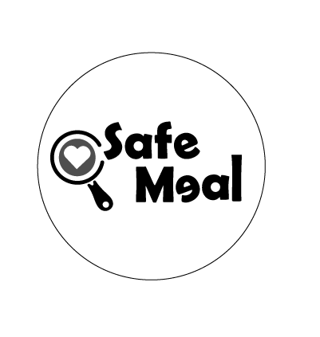

  

#  SMAS - SafeMeal System

**SafeMeal System** es un sistema desarrollado con Java y Spring Boot, orientado a brindar recomendaciones alimentarias a personas con restricciones o afecciones relacionadas con la alimentación.

---

## Tecnologías utilizadas

- Java
- Spring Boot
- MySQL
- JPA / Hibernate
- Postman
- HTML, CSS y JavaScript

---

## 📁 Estructura del proyecto

- `backend/`: desarrollo del backend con Spring Boot.
- `frontend/`: interfaz web del sistema.
- `docs/`: documentación del proyecto.
- `meeting-notes/`: bitácoras de reuniones.
- `postman/`: colección de pruebas en Postman.
- `sql/`: scripts relacionados con la base de datos.

---

## 👥 Integrantes

- Gabriela Calderón Benavides
- Kendall Pérez Cruz
- Denisse Ramírez Villarreal

---

## Estado del proyecto

Primera etapa: documentación inicial, definición de objetivos, alcance funcional, requisitos y cronograma.

---

## 📜 Historial de commits

| Fecha | Hash | Mensaje de commit | Autor |
|-------|------|-------------------|-------|
| 17/05/2026 | ad30c3e | Primer commit del proyecto | N1sse |
| 17/05/2026 | fb56f05 | Agrega estructura inicial de carpetas como lo indica el enunciado | N1sse |
| 17/05/2026 | 3571b8a | Agregando contenido al README y un identificador | N1sse |
| 17/05/2026 | 12ef05c | Actualizando la imagen para evitar problemas de visualización | N1sse |
| 17/05/2026 | f4d18b1 | Agregando la estructura de archivos y proyecto base del backend | N1sse |
| 17/05/2026 | f4d18b1 | Se actualizó parte de la información de la bitácora y se agregaron al README los commits realizados previamente
 | N1sse |

---

##  Notas

Este README será actualizado manualmente conforme avance el proyecto. Más adelante, podría implementarse una actualización automática mediante scripts o herramientas de automatización.
